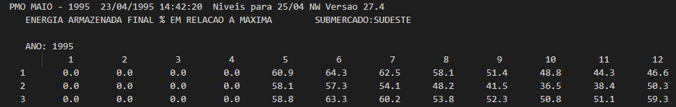

Tutorial
=========

Este guia pode ser um bom ponto inicial para o uso do *inewave*. Como interface de desenvolvimento é recomendado
usar algum editor com um `language server` com um recurso de sugestões automáticas eficiente para Python, como o
`VSCode <https://code.visualstudio.com/>`_ com `PyLance <https://marketplace.visualstudio.com/items?itemName=ms-python.vscode-pylance>`_
ou a IDE específica `PyCharm <https://www.jetbrains.com/pt-br/pycharm/download/>`_. As sugestões automáticas são essenciais para fazer uso de todo o potencial do
módulo *inewave*, além de auxiliar na escrita de códigos melhores.

Leitura, alteração e escrita do dger.dat
-----------------------------------------

Seja um sistema de arquivos no qual, dentro de um diretório cujo caminho é::

    $ pwd
    $ /home/usuario/estudo/pmo_MM_AAAA/

E neste diretório exista um arquivo ``dger.dat``, então o conteúdo deste pode ser lido 
através do código::

    >>> from inewave.newave.dger import DGer
    >>> dger = DGer.le_arquivo("/home/usuario/estudo/pmo_MM_AAAA/")

.. currentmodule:: inewave.newave.dger

É possível analisar todos os parâmetros existentes no arquivo `dger.dat`::

    >>> dger.ano_inicio_estudo
    1995
    >>> dger.imprime_mercados
    True

Se comparado com o conteúdo do arquivo `dger.dat`:

.. image:: figures/dger_antes.png
  :width: 180

Como o `dger.dat` também é um arquivo de entrada para o NEWAVE, este também possui
um recurso de escrita, que pode ser usado na geração de novos decks.

    >>> dger.ano_inicio_estudo = 2000
    >>> dger.imprime_dados_mercados = False
    >>> DGer.escreve_arquivo("/home/usuario/estudo/pmo_MM_AAAA/")

Ao visualizar as diferenças entre os arquivos:

.. image:: figures/dger_diff.png
  :width: 550

Para mais informações, basta consultar a referência do objeto `DGer`.

Realizando a leitura do pmo.dat
--------------------------------

Seja um sistema de arquivos no qual, dentro de um diretório cujo caminho é::

    $ pwd
    $ /home/usuario/estudo/pmo_MM_AAAA/

E neste diretório exista um arquivo ``pmo.dat``, então o conteúdo deste pode ser lido 
através do código::

    >>> from inewave.newave.pmo import PMO
    >>> pmo = PMO.le_arquivo("/home/usuario/estudo/pmo_MM_AAAA/")

.. currentmodule:: inewave.newave.pmo

É então constrúido um objeto :class:`PMO`, que fornece os dados do arquivo através de seus métodos::

    >>> pmo.convergencia
        Iteração  Lim. Inf. ZINF       ZINF  Lim. Sup. ZINF       ZSUP  Delta ZINF  ZSUP Iteração  Tempo (s)
    0          1       125551.48  177576.03       151496.59  138918.50         0.0            0.0      103.0
    1          1       120780.69  177576.03       156780.92  138918.50         0.0            0.0        0.0
    2          1       111659.63  177576.03       137604.74  125026.65         0.0            0.0        0.0
    3          2       125551.48  321359.37       151496.59  138918.50         0.0            0.0      122.0
    4          2       120780.69  321359.37       156780.92  138918.50         0.0            0.0        0.0
    ..       ...             ...        ...             ...        ...         ...            ...        ...
    91        31        74025.15  348963.75        88058.94   81322.01         0.0            0.0        0.0
    92        31        67603.11  348963.75        78384.09   73189.81         0.0            0.0        0.0
    93        32        75735.31  349073.00        86516.29   81322.01         0.0            0.0      277.0
    94        32        74025.15  349073.00        88058.94   81322.01         0.0            0.0        0.0
    95        32        67603.11  349073.00        78384.09   73189.81         0.0            0.0        0.0

Os dados extraídos pelo módulo encontram-se na respectiva tabela do arquivo:

.. image:: figures/pmo_convergencia.png
  :width: 600

Maiores detalhes podem ser obtidos na referência do objeto `PMO`.

Realizando a leitura do earmfpm00x.out
---------------------------------------

Seja um sistema de arquivos no qual, dentro de um diretório cujo caminho é::

    $ pwd
    $ /home/usuario/estudo/pmo_MM_AAAA/

E neste diretório exista um arquivo ``earmfpm001.out``, então o conteúdo deste pode ser lido 
através do código::

    >>> from inewave.nwlistop.earmfpm00 import LeituraEarmfpm00
    >>> leitor = LeituraEarmfpm00("/home/usuario/estudo/pmo_MM_AAAA/")
    >>> earm = leitor.le_arquivo()

.. currentmodule:: inewave.nwlistop.modelos.earmfpm00

É então constrúido um objeto :class:`Earmfpm00`, que fornece os dados do arquivo através de seus métodos::

    >>> earm
    {'SUDESTE': <inewave.nwlistop.modelos.earmfpm00.Earmfpm00 object at 0x000001BA8C905DC0>}
    >>> earm['SUDESTE'].ano_pmo
    1995
    >>> earm['SUDESTE'].energias_armazenadas[1995]
    [[ 0.   0.   0.  ... 48.8 44.3 46.6]
    [ 0.   0.   0.  ... 36.5 38.4 50.3]
    [ 0.   0.   0.  ... 50.8 51.1 59.3]
    ...
    [ 0.   0.   0.  ... 76.2 70.7 70.3]
    [ 0.   0.   0.  ... 41.  35.3 35.6]
    [ 0.   0.   0.  ... 59.8 63.2 68.1]]

Os dados extraídos pelo módulo encontram-se no arquivo:

Para maiores informações, basta consultar a referência `Earmfpm00`.

Realizando a leitura do MEDIAS-SIN.CSV
---------------------------------------

Seja um sistema de arquivos no qual, dentro de um diretório cujo caminho é::

    $ pwd
    $ /home/usuario/estudo/pmo_MM_AAAA/

E neste diretório exista um arquivo ``MEDIAS-SIN.CSV``, então o conteúdo deste pode ser lido 
através do código::

    >>> from inewave.nwlistop.mediassin import MediasSIN
    >>> medias = MediasSIN.le_arquivo("/home/usuario/estudo/pmo_MM_AAAA/")

.. currentmodule:: inewave.nwlistop.mediassin

É então constrúido um objeto :class:`MediasSIN`, que fornece os dados do arquivo através de seus métodos::

    >>> medias
    <inewave.nwlistop.mediassin.MediasSIN object at 0x00000166A7B59370>
    >>> meidas.energias_armazenadas_absolutas
     [220084.42 233433.78 240735.14 241453.06 235079.45 222240.84 207280.77
      196712.95 189801.23 194836.73 212676.14 229302.66 244305.27 254792.92
      259826.38 259259.97 252486.23 238415.73 221549.73 208798.81 200677.28
      205599.06 222007.42 237158.7  249949.94 259642.58 264656.34 263249.5
      255866.48 241392.38 224162.03 210948.72 202249.97 205928.23 222097.14
      237495.98 251485.92 261095.86 265716.56 263798.31 256055.05 240889.86
      223191.25 208994.06 198852.64 202126.69]

Os dados extraídos pelo módulo encontram-se no arquivo:

.. image:: figures/mediassin.png
  :width: 800

Para maiores informações, basta consultar a referência `MediasSIN`.