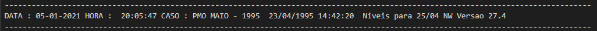

Tutorial
=========

Este guia pode ser um bom ponto inicial para o uso do *inewave*. Como interface de desenvolvimento é recomendado
usar algum editor com um `language server` com um recurso de `autocomplete` eficiente para Python, como o
`VSCode <https://code.visualstudio.com/>`_ com `PyLance <https://marketplace.visualstudio.com/items?itemName=ms-python.vscode-pylance>`_
ou a IDE específica `PyCharm <https://www.jetbrains.com/pt-br/pycharm/download/>`_. O `autocomplete` é essencial para fazer uso de todo o potencial do
módulo *inewave*, além de auxiliar na escrita de códigos melhores.

Leitura, alteração e escrita do dger.dat
-----------------------------------------

Seja um sistema de arquivos no qual, dentro de um diretório cujo caminho é::

    $ pwd
    $ /home/usuario/estudo/pmo_MM_AAAA/

E neste diretório exista um arquivo ``dger.dat``, então o conteúdo deste pode ser lido 
através do código::

    >>> from inewave.newave.dger import LeituraDGer, EscritaDGer
    >>> leitor = LeituraDGer("/home/usuario/estudo/pmo_MM_AAAA/")
    >>> dger = leitor.le_arquivo()

.. currentmodule:: inewave.newave.modelos.dger

É possível analisar todos os parâmetros existentes no arquivo `dger.dat`::

    >>> dger.ano_inicio_estudo
    1995
    >>> dger.imprime_dados_mercados
    True

Se comparado com o conteúdo do arquivo `dger.dat`:

.. image:: figures/dger_antes.png
  :width: 180

Como o `dger.dat` também é um arquivo de entrada para o NEWAVE, este também possui
um recurso de escrita, que pode ser usado na geração de novos decks.

    >>> dger.ano_inicio_estudo = 2000
    >>> dger.imprime_dados_mercados = False
    >>> escritor = EscritaDGer("/home/usuario/estudo/pmo_MM_AAAA/")
    >>> escritor.escreve_arquivo()

Ao visualizar as diferenças entre os arquivos:

.. image:: figures/dger_diff.png
  :width: 550

Para mais informações, basta consultar a referência do objeto `DGer`.

Realizando a leitura do pmo.dat
--------------------------------

Seja um sistema de arquivos no qual, dentro de um diretório cujo caminho é::

    $ pwd
    $ /home/usuario/estudo/pmo_MM_AAAA/

E neste diretório exista um arquivo ``pmo.dat``, então o conteúdo deste pode ser lido 
através do código::

    >>> from inewave.newave.pmo import LeituraPMO
    >>> leitor = LeituraPMO("/home/usuario/estudo/pmo_MM_AAAA/")
    >>> pmo = leitor.le_arquivo()

.. currentmodule:: inewave.newave.modelos.pmo

É então constrúido um objeto :class:`PMO`, que fornece os dados do arquivo através de seus métodos::

    >>> pmo
    <inewave.newave.modelos.pmo.PMO object at 0x000001BC7663B340>
    >>> pmo.ano_pmo
    1995
    >>> pmo.mes_pmo
    5
    >>> pmo.versao_newave
    '27.4'

Os dados extraídos pelo módulo encontram-se no cabeçalho do arquivo:

É possível obter também outras informações sobre o arquivo `pmo.dat`, como o custo total de operação::

    >>> pmo.custo_series_simuladas
    <inewave.newave.modelos.pmo.CustoOperacaoPMO object at 0x0000023B14525640>
    >>> leitor.pmo.custo_series_simuladas.custos
    [[1.895133e+04 1.292100e+02 9.082000e+01]
    [2.228000e+01 2.228000e+01 1.100000e-01]
    [8.800000e-01 1.000000e-02 0.000000e+00]
    [0.000000e+00 0.000000e+00 0.000000e+00]
    [1.010490e+03 9.999000e+01 4.840000e+00]
    [0.000000e+00 0.000000e+00 0.000000e+00]
    [7.061000e+01 1.486000e+01 3.400000e-01]
    [1.837600e+02 2.226000e+01 8.800000e-01]
    [0.000000e+00 0.000000e+00 0.000000e+00]
    [1.530000e+00 1.000000e-02 1.000000e-02]
    [0.000000e+00 0.000000e+00 0.000000e+00]
    [1.150000e+00 1.000000e-02 1.000000e-02]
    [6.257700e+02 1.387200e+02 3.000000e+00]
    [0.000000e+00 0.000000e+00 0.000000e+00]
    [0.000000e+00 0.000000e+00 0.000000e+00]
    [0.000000e+00 0.000000e+00 0.000000e+00]]

Os dados extraídos pelo módulo encontram-se na respectiva tabela do arquivo:

.. image:: figures/pmo_custos_series.png
  :width: 400

Informações específicas de cada custo estão disponíveis através de propriedades do objeto. Maiores detalhes podem ser obtidos na referência do objeto `CustoOperacaoPMO`.

Realizando a leitura do earmfpm00x.out
---------------------------------------

Seja um sistema de arquivos no qual, dentro de um diretório cujo caminho é::

    $ pwd
    $ /home/usuario/estudo/pmo_MM_AAAA/

E neste diretório exista um arquivo ``earmfpm001.out``, então o conteúdo deste pode ser lido 
através do código::

    >>> from inewave.nwlistop.earmfpm00 import LeituraEarmfpm00
    >>> leitor = LeituraEarmfpm00("/home/usuario/estudo/pmo_MM_AAAA/")
    >>> earm = leitor.le_arquivo()

.. currentmodule:: inewave.nwlistop.modelos.earmfpm00

É então constrúido um objeto :class:`Earmfpm00`, que fornece os dados do arquivo através de seus métodos::

    >>> earm
    {'SUDESTE': <inewave.nwlistop.modelos.earmfpm00.Earmfpm00 object at 0x000001BA8C905DC0>}
    >>> earm['SUDESTE'].ano_pmo
    1995
    >>> earm['SUDESTE'].energias_armazenadas[1995]
    [[ 0.   0.   0.  ... 48.8 44.3 46.6]
    [ 0.   0.   0.  ... 36.5 38.4 50.3]
    [ 0.   0.   0.  ... 50.8 51.1 59.3]
    ...
    [ 0.   0.   0.  ... 76.2 70.7 70.3]
    [ 0.   0.   0.  ... 41.  35.3 35.6]
    [ 0.   0.   0.  ... 59.8 63.2 68.1]]

Os dados extraídos pelo módulo encontram-se no arquivo:

.. image:: figures/earmfpm.png
  :width: 800

Para maiores informações, basta consultar a referência `Earmfpm00`.

Realizando a leitura do MEDIAS-SIN.CSV
---------------------------------------

Seja um sistema de arquivos no qual, dentro de um diretório cujo caminho é::

    $ pwd
    $ /home/usuario/estudo/pmo_MM_AAAA/

E neste diretório exista um arquivo ``MEDIAS-SIN.CSV``, então o conteúdo deste pode ser lido 
através do código::

    >>> from inewave.nwlistop.mediassin import LeituraMediasSIN
    >>> leitor = LeituraMediasSIN("/home/usuario/estudo/pmo_MM_AAAA/")
    >>> medias = leitor.le_arquivo()

.. currentmodule:: inewave.nwlistop.modelos.mediassin

É então constrúido um objeto :class:`MediasSIN`, que fornece os dados do arquivo através de seus métodos::

    >>> medias
    <inewave.nwlistop.modelos.mediassin.MediasSIN object at 0x00000166A7B59370>
    >>> meidas.energias_armazenadas_absolutas
    [     0.        0.        0.        0.        0.        0.   120566.76
     105553.39  87866.46  74628.94  67384.13  77175.59 103751.27 136444.19
     164715.61 179063.05 183767.11 180670.34 170009.45 152021.25 133067.83
     119809.86 113629.52 126772.7  154290.17 184992.48 209113.53 221483.92
     225683.23 221905.92 209850.84 191386.5  170983.23 155676.92 148345.86
     161091.2  185402.48 210185.28 228901.59 238740.84 241397.98 236743.05
     221605.42 198691.84 173918.48 153725.42 141373.53 150448.61 174727.58
     201001.23 222784.55 234152.59 238611.41 232602.72 216908.98 193381.59
     168287.48 148162.03 136430.67 145501.89]

Os dados extraídos pelo módulo encontram-se no arquivo:

.. image:: figures/mediassin.png
  :width: 800

Para maiores informações, basta consultar a referência `MediasSIN`.